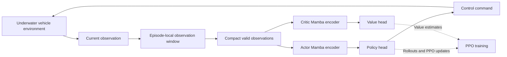

# MarineMamba

### Selective State-Space Reinforcement Learning for Linear-Complexity Control of Unmanned Underwater Vehicles

**History-aware underwater control with Mamba and Proximal Policy Optimization (PPO).**

MarineMamba encodes a short window of vehicle observations with a selective state-space model to support trajectory tracking under partially observed dynamics. Evaluated across **4 tasks and 3 vehicles**, it achieves the best overall control-metric rank among the evaluated policies, with **71% fewer trainable parameters than PPO-Transformer** in the reported reference configuration.

[Repository](https://github.com/UPC-TZ/MarineMamba) · [Method](#method) · [Results](#results) · [Experimental Setup](#experimental-setup) · [Citation](#citation)

> This README summarizes the accompanying research manuscript. Performance figures are reported by the paper; tracking experiments are conducted in simulation, with separate inference measurements on an NVIDIA Jetson Orin NX.

## Overview

Underwater vehicles must follow reference trajectories despite nonlinear hydrodynamics, actuator lag, changing currents, and payload variations. A single observation does not fully reveal these factors, while recent observations contain information about their effects on motion.

MarineMamba uses a **selective Mamba-1 encoder** to read this history as a recurrence. Its input-dependent state updates retain useful temporal information and forget less relevant observations, with encoding cost that grows linearly with the window length. Separate actor and critic encoders are trained on-policy with PPO.

### Highlights

- **Compact temporal policy:** a 32-observation window, two Mamba blocks, and lightweight linear heads.
- **Episode-aware history:** valid-prefix compaction and buffer resets prevent observations from crossing episode boundaries.
- **Broad simulation evaluation:** one architecture and training configuration across 12 task–vehicle combinations, with a separately trained policy for each combination.
- **Robustness against the attention baseline:** lower post-event error and longer survival in all 24 tested disturbance and sensor-corruption conditions; smoother actuation in 20.
- **Embedded inference:** an average of 8.33 ms per command on Jetson Orin NX, within the 16 ms control period.

## Method

1. **Construct the observation window.** Retain up to 32 observations from the current episode and compact the valid entries before encoding.
2. **Encode temporal dynamics.** Project observations into 80-dimensional tokens and process them through two residual Mamba-1 blocks.
3. **Produce policy and value outputs.** Read the final valid feature using separate actor and critic networks. Training samples policy actions; evaluation uses the policy mean.
4. **Optimize with PPO.** Use generalized advantage estimation, a clipped policy objective, and value-function learning.

The window contains observations only; past actions are not appended as separate tokens. The paper establishes linear window-encoding complexity, episode isolation, and bounded recurrent state under its stated assumptions.

**Deployment detail:** the reported implementation re-encodes the finite window at every control step. The latency results therefore measure window-based inference, rather than a cached streaming implementation.

## Results

### Control performance

Across 13 control metrics and 12 task–vehicle combinations:

| Measure | PPO | PPO-Transformer | MarineMamba |
|---|---:|---:|---:|
| Overall average rank ↓ | 1.79 | 2.32 | **1.54** |
| Metric–combination pairs with the best mean ↑ | 65 | 39 | **88** |
| Combinations won by average rank ↑ | 4 | 0 | **8** |

Best-mean counts include ties and therefore do not sum to 156. MarineMamba achieves the **best or tied full-horizon completion rate on all 12 combinations**. These aggregate results do not imply that it wins every individual metric.

The evaluation covers return, episode length, completion rate, time to failure, tracking-error statistics, failure-aware integrated error, actuation-effort proxies, and command smoothness. The effort proxies are not measurements of electrical energy.

### Unseen disturbances and sensor corruption

The robustness tests compare MarineMamba with PPO-Transformer using their BlueROV Heavy helical-tracking checkpoints. Events begin after 32 nominal steps, and each family contains three severity levels.

| Protocol | Tested conditions | Reported outcome versus PPO-Transformer |
|---|---|---|
| Unseen dynamics | Actuator lag, current steps, thruster degradation, payload changes | Lower post-event error and longer survival in all 12 conditions |
| Sensor corruption | Gaussian noise, channel loss, observation holds, observation delays | Lower post-event error and longer survival in all 12 conditions |

Across both protocols, MarineMamba produces smoother commands in **20 of 24 conditions**. The paper reports aggregate post-event error reductions of **14%** for unseen dynamics and **21%** for sensor corruption. Post-event error is evaluated using a failure-padded integral of absolute tracking error over the one-second post-event interval.

### Desktop efficiency

Measured on an NVIDIA GeForce RTX 4090:

| Policy | Trainable parameters ↓ | Inference latency (ms) ↓ | Training frames/s ↑ |
|---|---:|---:|---:|
| PPO | 289,553 | 0.165 ± 0.004 | 29,436 |
| PPO-Transformer | 324,417 | 1.026 ± 0.022 | 11,697 |
| **MarineMamba** | **94,017** | **0.964 ± 0.018** | **16,851** |

Parameter counts include the actor and critic for BlueROV Heavy on the helical task. Latency is measured at batch size one and aggregated across the 12 combinations. Throughput comes from isolated training runs on the BlueROV Heavy helical task.

Relative to PPO-Transformer, MarineMamba uses **71.0% fewer parameters** and achieves **44.1% higher training throughput**. Current-state PPO remains faster, but does not encode an observation history.

### Embedded inference

Exported actors evaluated on an **NVIDIA Jetson Orin NX**:

| Measure | PPO | PPO-Transformer | MarineMamba |
|---|---:|---:|---:|
| Actor parameters across configurations | 142,086–145,680 | 161,366–162,496 | **46,166–47,296** |
| Mean inference time (ms) | 2.27 ± 0.24 | 8.00 ± 0.13 | 8.33 ± 0.18 |
| Reported policy RAM (MB) | 0.550 | 0.619 | **0.179** |

MarineMamba uses approximately **52% of the 16 ms control period** and reports approximately **71% lower policy RAM** than PPO-Transformer. The two history policies have similar embedded latency; MarineMamba is slightly slower in this measurement. Memory values follow the paper's policy-level reporting and should not be interpreted as total board memory usage.

## Experimental Setup

### Tasks and vehicles

| Task | Reference | Episode horizon |
|---|---|---:|
| `Hover` | Fixed pose | 200 steps |
| `Track` | Lemniscate | 600 steps |
| `TrackCircle` | Circle | 600 steps |
| `TrackSpiral` | Helix | 600 steps |

The three simulated vehicles are **BlueROV**, **BlueROV Heavy**, and **iAUV**. Tracking references vary in scale, orientation, and traversal rate at reset.

### Configuration

| Setting | Value |
|---|---|
| Simulator | MarineGym, built on Isaac Sim |
| Physics step / control rate | 0.016 s / 62.5 Hz |
| Parallel environments | 256 |
| History window | 32 observations / 0.512 s |
| Mamba blocks / token width | 2 / 80 |
| SSM state size / convolution width / expansion | 4 / 2 / 1 |
| Rollout length | 64 steps |
| PPO epochs / minibatches per update | 4 / 16 |
| Learning rate | 0.0005 |
| Discount / GAE lambda | 0.99 / 0.95 |
| PPO clip range | 0.1 |
| Training budget per policy and combination | 19,988,480 frames |

**Software reported in the paper:** PyTorch 2.2.2, CUDA 12.1, `mamba-ssm` 1.2.2, and `causal-conv1d` 1.4.0. Embedded measurements use JetPack 6.2 and Linux for Tegra 36.4.3.

### Evaluation scope

Each policy is trained once per task–vehicle combination. Retained checkpoints are evaluated with deterministic actions on ten paired evaluation seeds. A predefined modified-z-score rule removes the union of flagged seeds across compared policies, preserving paired comparisons; reported statistics use the retained seeds.

Flow and variable-payload disturbances are disabled during training and the main task–vehicle evaluation. They are introduced only in the robustness protocols. Physical-vehicle validation and embedded timing across multiple window lengths remain future work.

## Reproduction

The configuration above records the experimental settings described in the manuscript. Installation commands, training entry points, checkpoint downloads, and repository layout are not specified here because they require verification against the released code.

## Citation

If you use this work, please cite the accompanying manuscript:

> Tianze Zhang, Xiaowen Tao, Min Lou, Yangyang Wang, and Hongde Qin. **MarineMamba: Selective State-Space Reinforcement Learning for Linear-Complexity Control of Unmanned Underwater Vehicles.**

Publication venue, year, and DOI are omitted because the supplied manuscript does not establish final publication metadata.

## Acknowledgments

This work builds on MarineGym, PPO, and the Mamba selective state-space architecture. The manuscript acknowledges support from the National Natural Science Foundation of China (Grant No. 52501414), the Youth Fund of the Natural Science Foundation of Shandong Province (Grant No. ZR2025QC1099), and the Shandong Provincial University Youth Innovation Science and Technology Support Program (Grant No. 2025KJH208).
